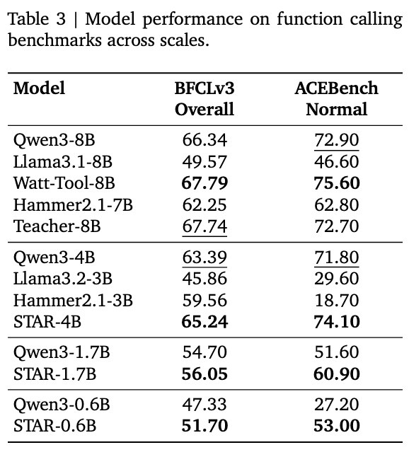

<h1 align="center">STAR: Similarity-guided Teacher-Assisted Refinement for Super-Tiny Function Calling Models </h1>

<p align="center">
  <a></a> 
  <a href='https://arxiv.org/abs/2602.03022'></a>
  <a href='https://huggingface.co/star-lab'></a>
  <a href='https://huggingface.co/star-lab'></a>
  <a href="https://opensource.org/licenses/Apache-2.0"></a>
</p>

<p align="center">
  <i><b>  Algorithm Platform Team, AI Hardware Division, Alibaba</b></i>
</p>

This repository contains the code and instructions necessary to reproduce the experiments presented in the paper: **"STAR: Similarity-guided Teacher-Assisted Refinement for Super-Tiny Function Calling Models"**, accepted to ICLR 2026.

**STAR (Similarity-guided Teacher-Assisted Refinement)** is a novel holistic framework designed to effectively transfer the function calling capabilities of large language models (LLMs) to super-tiny, cost-efficient models. Our STAR training curriculum involves the two processes:
1.  **Constrained Knowledge Distillation (CKD):** The selected teacher's knowledge is transferred to a super-tiny student model (e.g., **0.6B**) using our novel **Constrained Knowledge Distillation (CKD)** objective, which ensures training stability and preserves exploratory capacity.
2.  **Similarity-guided Reinforcement Learning (Sim-RL):** The distilled student model is polished with **Sim-RL** to enhance its generalization capability and optimize its performance on complex problems.


# 🔥 News

- **[2025.02.04]** We released the STAR codebase, including implementations for CKD and Sim-RL.
- **[2025.02.04]** Our paper is now available on arXiv: [2602.03022](https://arxiv.org/abs/2602.03022).
- **[2026.01.26]** Our paper has been accepted to ICLR 2026!


# 💡 Main Results

Our STAR models establish new state-of-the-art performance in their size classes. The STAR framework significantly closes the performance gap with much larger models.

<p align="center">
  
</p>

# 🛠️ Installation

We rely on [uv](https://docs.astral.sh/uv/getting-started/installation/) for Python environment management and [OpenRLHF](https://github.com/OpenRLHF/OpenRLHF) for our RL training framework.

1.  **Create Python Environment**

    ```bash
    # Create a virtual environment using uv
    uv venv --seed --python 3.12 ./train-env

    # Install dependencies
    uv pip sync -p ./train-env/bin/python ./requirements_uv.txt
    
    source ./train-env/bin/activate
    ```

2.  **Install Patched OpenRLHF**

    ```bash
    # Clone the specific commit of OpenRLHF
    git clone https://github.com/OpenRLHF/OpenRLHF.git
    cd OpenRLHF
    git checkout c1fc63a9f7e1837577a76b0c688809b3c0bdc644

    # Apply the patch for CKD functionality
    git apply ../0001-add-ckd.patch
    cd ..
    ```

# 🎯 Quick Start

## Model Preparation

Download the base models from Hugging Face. We use the Qwen-8B model as the teacher and smaller models as students.
```bash
# Teacher Model
huggingface-cli download star-lab/Teacher-8B --local-dir models/Teacher-8B

# Student Models (e.g., 0.6B)
huggingface-cli download Qwen/Qwen3-0.6B --local-dir models/Qwen3-0.6B
```
                
## Data Preparation

Both CKD and SimRL require datasets in `jsonlines` format, where each line is a JSON object with two fields:
- `inputs`: The prompt formatted with the Qwen chat template.
- `outputs`: The response formatted with the Qwen chat template.

We recommend organizing your data into a structured format first (e.g., using the `messages` API format) and then converting it.

**Example structured format:**
```json
{
    "messages": [
        {"role": "system", "content": "..."},
        {"role": "user", "content": "..."},
        {"role": "assistant", "content": "...", "tool_calls": [...], "reasoning_content": "..."},
        {"role": "tool", "content": "..."},
    ],
    "tools": [
        {"name": "...", "description": "...", "parameters": ...},
    ]
}
```

The example_messages.jsonl file is provided as an example, containing 1024 random samples from the xlam50k dataset. Based on this structured data, the training data for CKD can be generated using the `teacher_rollout.py` script, while the training data for Sim-RL can be generated using the `messages_to_trainset.py` script:

CKD data:
```bash
python teacher_rollout.py --input=example_messages.jsonl --output=kd_messages.jsonl --model-path ./models/Teacher-8B --rollout-n 8 --dp-size 8 

python messages_to_trainset.py --input=kd_messages.jsonl --output=kd_data.jsonl --tokenizer-path=./models/Teacher-8B --add-reasoning-content
```

SimRL data:
```bash
python messages_to_trainset.py --input=example_messages.jsonl --output=rl_data.jsonl --tokenizer-path=./models/Teacher-8B
```

## Training: The STAR Curriculum

Before starting, prepare the environment for a training run:
```bash
export PYTHONPATH=$PWD/OpenRLHF
ray start --head --node-ip-address 0.0.0.0 --num-gpus 8 --disable-usage-stats
```

### Phase 1: Constrained Knowledge Distillation (CKD)

First, distill knowledge from the teacher model to the student using CKD. This step requires training data generated by the teacher model. We provide `teacher_rollout.py` as a reference for generating these samples.

After preparing your models and data, edit the paths in `scripts/train_ckd.sh` and run it:
```bash
bash scripts/train_ckd.sh
```
The distilled student model will be saved to the path specified in the script (e.g., `checkpoints/student-0.6b-ckd`).

### Phase 2: Similarity-guided Reinforcement Learning (Sim-RL)

Next, refine the CKD-distilled student model using Sim-RL to further boost its capabilities. While Sim-RL can be applied to any base model, it is most effective when used on a model already trained with CKD.

Update the model and data paths in `scripts/train_sim_rl.sh` and run the script:
```bash
bash scripts/train_sim_rl.sh
```
The final `STAR-0.6B` model will be saved to the path specified in the script (e.g., `checkpoints/star-0.6b`).

# 🙏🏻 Acknowledgements

This project is built upon the [OpenRLHF](https://github.com/OpenRLHF/OpenRLHF) framework. We thank the original authors for their significant open-source contributions.

# ⭐️ Citation

If you find this work useful, please kindly cite our paper:
```bibtex
@misc{ni2026starsimilarityguidedteacherassistedrefinement,
      title={STAR: Similarity-guided Teacher-Assisted Refinement for Super-Tiny Function Calling Models}, 
      author={Jiliang Ni and Jiachen Pu and Zhongyi Yang and Jingfeng Luo and Conggang Hu},
      year={2026},
      eprint={2602.03022},
      archivePrefix={arXiv},
      primaryClass={cs.AI},
      url={https://arxiv.org/abs/2602.03022}, 
}
```
